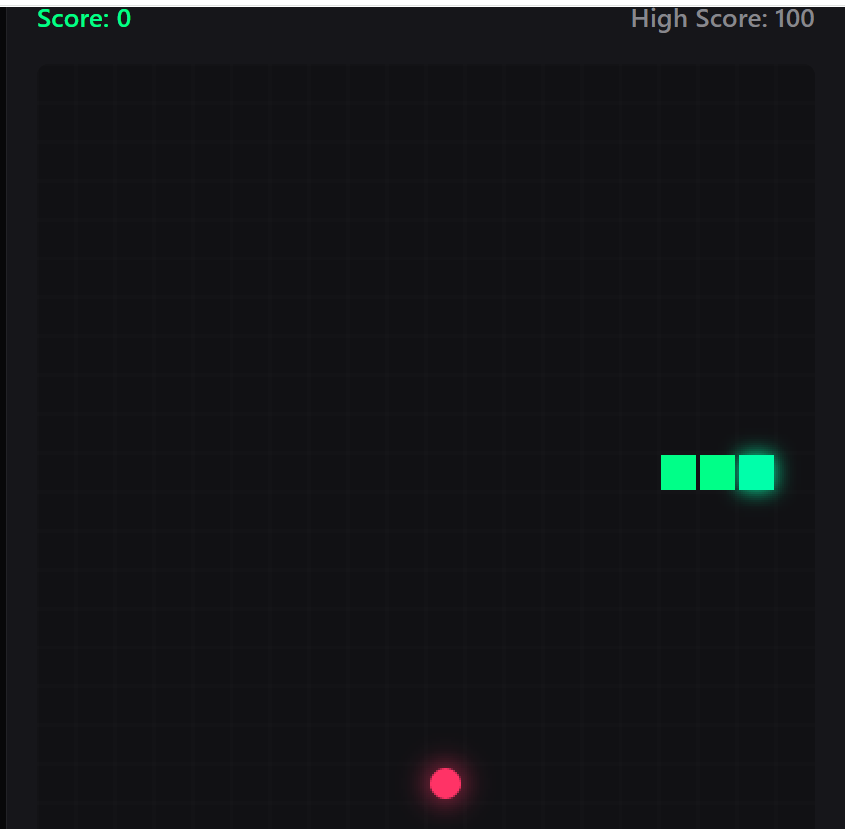

# Snake Game

A classic Snake game implemented as a web application.



## Table of Contents

- [About](#about)
- [Installation](#installation)
- [Usage](#usage)
- [Technologies](#technologies)

## About

This is a simple Snake game built using web technologies. The goal of the game is to control a snake, eat food to grow, and avoid colliding with walls or the snake's own body.

## Installation

To install the project dependencies, navigate to the root directory of the project and run:

```bash
npm install
```

## Usage

After installation, you can run the development server:

```bash
npm run dev
```

Open your browser and navigate to the address indicated in the console (usually `http://localhost:3000`).

## Technologies

- HTML
- CSS
- TypeScript
- npm (for package management)
